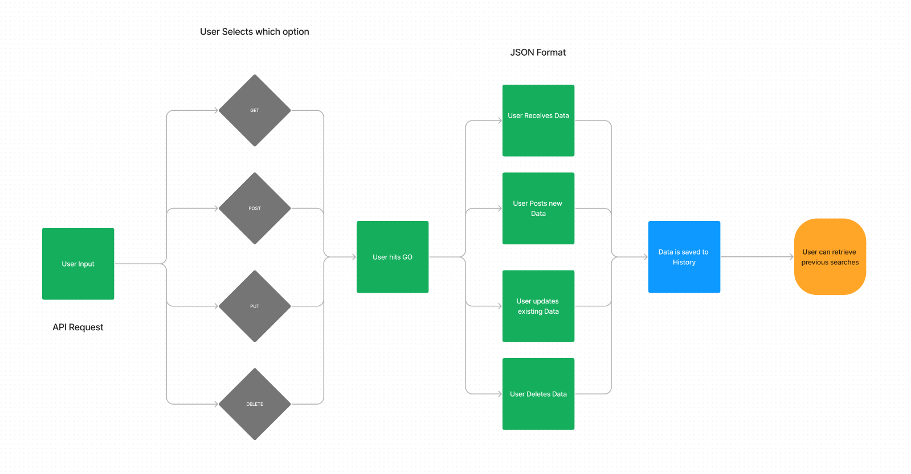

# React + Vite

LAB - 28
RESTy running live with requests

enables an active site that will get api information from a live API instead of hardcoding information.

Author: Jonathan Brooks

[Pull Request](https://github.com/jonbrooks01/resty/pull/5)

<!-- [deployed server](https://basic-server-4efy.onrender.com) -->

Setup
<!-- .env requirements:PORT - 3001 -->

Running the app: npm run dev

Endpoint: Returns Object

<!-- {
  "domain": "deployment-practice-main.onrender.com/",
  "status": "{name: name}",
 "port":
} -->
Tests
Unit Tests: npm run test
<!-- Lint Tests: npm run lint -->

<!-- UML:
 -->

This template provides a minimal setup to get React working in Vite with HMR and some ESLint rules.

Currently, two official plugins are available:

- [@vitejs/plugin-react](https://github.com/vitejs/vite-plugin-react/blob/main/packages/plugin-react/README.md) uses [Babel](https://babeljs.io/) for Fast Refresh
- [@vitejs/plugin-react-swc](https://github.com/vitejs/vite-plugin-react-swc) uses [SWC](https://swc.rs/) for Fast Refresh

Technical Requirements / Note
Extend your application to include the ability to send http requests and display response data, when the <Form /> component experiences a submission event.

Refactor application methods to allow for browser side HTTP requests to be sent.
Your implementation should allow the user to set a url, method, and request body.
Make sure all relevant request and response data is displayed to the User.
Suggested approach:

<Form /> component, onSubmit() sends the user’s entries to the <App /> via method sent in through props.
<App /> does a check on the request data from the form and updates the request variable in state with the url, method, and potentially the body.
<App /> has an effect hook that’s looking for changes to the request variable in state, and in response, runs the API request with the new request options from state.
<App /> updates state with the results of the API Request.
<Results /> sees the new API data as a prop and renders the JSON. The JSON data should be complete. i.e. not only include results, but also include pagination data if present (next, previous and count), if using axios.
Note: update your <Results /> component to use a 3rd party component to “pretty print” the JSON in a color-coded, user-friendly format.